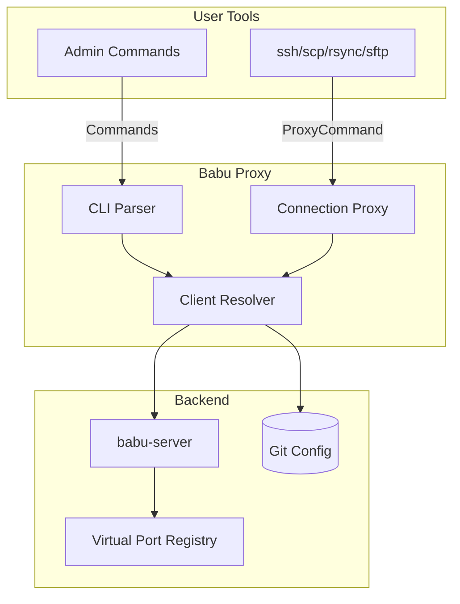

# Babu-Proxy Design

## Overview

`babu-proxy` serves as the unified interface for accessing devices through
babu-server's virtual ports. It provides both ProxyCommand functionality for
transparent SSH access and a CLI for system management.

## Dual Purpose Design

### 1. ProxyCommand Mode

Used transparently by SSH tools to establish connections:

```bash
# Direct usage
ssh -o 'ProxyCommand babu-proxy connect %h' rogueN

# Via .ssh/config
Host rogue*
    ProxyCommand babu-proxy connect %h

Host client-*
    ProxyCommand babu-proxy connect %h
```

Once configured, all SSH-based tools work seamlessly:

```bash
ssh rogueN                          # Interactive SSH
rsync -av files/ rogueN:/backup/   # File sync
scp config.txt rogueN:/etc/         # File copy
sftp rogueN                         # File transfer
```

### 2. CLI Mode

Administrative interface for querying and managing the system:

```bash
# List clients
babu-proxy list                     # All clients
babu-proxy list --status=online     # Connected clients
babu-proxy list --status=dropped    # Recently disconnected
babu-proxy list --compromised       # Clients with compromised keys

# Client information
babu-proxy show rogueN              # Detailed client info
babu-proxy status rogueN            # Connection status
babu-proxy history rogueN           # Connection history

# Registration operations
babu-proxy register rogueN --crm-id=12345 --hostname=client-name
babu-proxy rekey client-name        # Initiate rekeying

# Compromise management
babu-proxy list --key=<keyfingerprint>  # Find all clients using a key
babu-proxy quarantine --key=<keyfingerprint>  # Mark key as compromised
```

## Architecture



## Key Features

### Client Resolution

The proxy resolves client identities:

1. Check Git configuration for client details
2. Lookup virtual port in babu-server
3. Establish connection through virtual port
4. Handle connection multiplexing

### Connection Telemetry

`babu-server` provides rich telemetry that `babu-proxy` exposes:

- **Connect events**: timestamp, source IP, auth method
- **Disconnect events**: timestamp, duration, reason
- **Drop events**: keepalive timeout, last seen
- **Reconnect events**: downtime duration

### Compromise Detection and Management

When a key is used by multiple clients:

1. **Detection**: Second use of same key triggers compromise flag
2. **Tracking**: All connections with compromised key are logged
3. **Quarantine**: Clones get assigned ports in separate range
4. **Recovery**: Systematic rekey and re-registration process

```bash
# Compromise workflow
babu-proxy list --compromised           # List all compromised clients
babu-proxy show --key=<fingerprint>     # Show all clients using key
babu-proxy rekey original-client        # Generate new key for legitimate client
babu-proxy register clone-1 --crm-id=X  # Re-register legitimate clones
babu-proxy revoke --key=<fingerprint>   # Block compromised key after recovery
```

## Client Configuration

`babu-proxy` uses Git-backed configuration for client management:

```yaml
# Client configuration
clients:
  - name: rogueN
    port: 40000+N
    key: "ssh-rsa ..."
    services: ["ntp", "dns"]

  - name: client-prod
    port: 25000+CRM
    key: "ssh-rsa ..."
    services: ["ntp", "dns", "socks5"]
```

All client connections are handled through babu-server's virtual port system.

## Implementation Considerations

### Performance

- Cache client configurations for fast lookups
- Connection pooling for frequently accessed clients
- Async telemetry updates to avoid blocking

### Security

- Validate all client identities before connection
- Log all access attempts
- Support for audit trails

### Reliability

- Handle connection failures gracefully
- Automatic reconnection support
- Clear error messages for troubleshooting

## Port Allocation for Clones

When detecting compromised keys:

- Original client keeps its assigned port
- Clones get ports from a quarantine range (specific range TBD)
- Each clone tracked separately: `clone-${original}-${counter}`
- Enables inventory and recovery without losing devices

## Integration with SSH Tools

### SSH Configuration Generation

```bash
# Generate .ssh/config entries
babu-proxy generate-config > ~/.ssh/config.d/babu

# Include in main SSH config
echo "Include ~/.ssh/config.d/*" >> ~/.ssh/config
```

### Scripting Support

```bash
# Check before operations
if babu-proxy status "$CLIENT" | grep -q online; then
    ssh "$CLIENT" "command"
fi

# Bulk operations
babu-proxy list --status=online | while read client; do
    ssh "$client" "update-command"
done
```

## Future Enhancements

1. **Web Dashboard**: Real-time visualization of client status
2. **Metrics Export**: Prometheus/Grafana integration
3. **Batch Operations**: Rekey/update multiple clients
4. **Policy Engine**: Automated responses to events
5. **Integration APIs**: REST/gRPC for external tools
