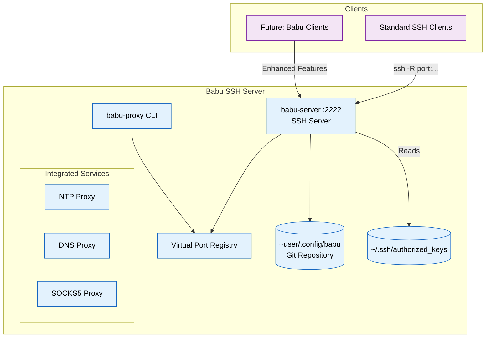
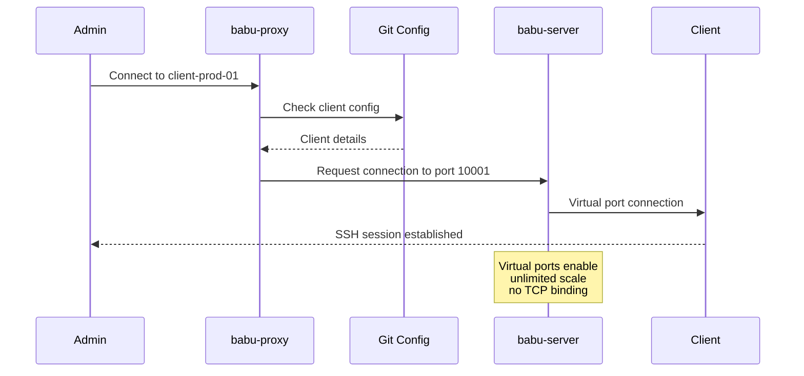

# Babu Architecture Overview

## Design Philosophy

Babu is an innovative SSH server that revolutionizes device connectivity:

1. Virtual ports eliminate TCP port limitations
2. Integrated services (NTP, DNS, SOCKS5) over SSH
3. Dual-mode operation for devices and administrators
4. Git-backed configuration for reliability

## System Architecture



## Key Design Decisions

### 1. **SSH Server with Dual Functionality**

- `babu-server` is a full SSH server implementation replacing OpenSSH
- **For devices**: Virtual ports - `-R` requests don't bind TCP ports
- **For admins**: Real shell access for root and administrative users
- Reads standard `~/.ssh/authorized_keys` for all authentication
- Compatible with all existing SSH clients

### 2. **Git-Backed Configuration Model**

```yaml
# ~babu/.config/babu/devices/device-10001.yaml
device:
  name: "client-prod-01"
  port: 10001
  public_key: "ssh-rsa AAAA..."
  services:
    - ntp
    - dns

# ~babu/.config/babu/devices/device-10002.yaml
device:
  name: "client-prod-02"
  port: 10002
  public_key: "ssh-rsa BBBB..."
  services:
    - ntp
    - dns
    - socks5
```

### 3. **Connection Flow**



## Getting Started

### Server Setup

```bash
# Install babu-server
systemctl start babu-server  # Listens on port 2222

# Create device user(s)
useradd -m -s /bin/false babu
useradd -m -s /bin/false acme  # Optional: custom device user

# Initialize git repository for each device user
su - babu -s /bin/bash -c "git init ~/.config/babu"
su - acme -s /bin/bash -c "git init ~/.config/babu"
```

### Device Connection

```bash
# Devices connect with SSH using virtual ports
ssh -R 26048:127.0.0.1:22 babu@server:2222
# Or with custom user:
ssh -R 26048:127.0.0.1:22 acme@server:2222

# No TCP port 26048 is bound!
# Virtual port 26048 is registered in memory
```

### Admin Access

```bash
# Administrators get full shell
ssh root@server:2222

# Access devices via virtual ports
babu-proxy connect 26048
```

## Configuration Management

### Git Repository Structure

```bash
# Each device user has ~/.config/babu/ git repository
# Example: /home/acme/.config/babu/
~acme/.config/babu/
├── .git/                    # Git repository
├── devices/                 # Device configurations
│   ├── device-26048.yaml   # Auto-created on connection
│   ├── device-26049.yaml
│   └── ...
├── groups/                  # Device grouping
│   ├── production.yaml
│   └── staging.yaml
├── services/               # Service configurations
│   ├── ntp.yaml
│   └── dns.yaml
└── README.md

# Device config example (devices/device-26048.yaml):
device:
  port: 26048
  name: "sensor-prod-01"
  registered: "2024-01-15T10:30:00Z"
  public_key: "ssh-rsa AAAA..."
  services: ["ntp", "dns"]
  metadata:
    location: "Building A"
    serial: "SN123456"
# Note: Connection state tracked in memory/telemetry, not git
```

### Configuration Changes in Git

```bash
# babu-server commits configuration changes only
cd ~acme/.config/babu
git log --oneline
# 3f4a2b1 Device 26048 registered with new key
# 2e1c3d4 Device 26049 added to production group
# 1a5b6c7 Updated NTP service configuration

# Connection events go to system logs/telemetry
journalctl -u babu-server | grep 26048
# Jan 20 14:22:00 babu-server[1234]: Device 26048 connected from 192.168.1.50
# Jan 20 18:45:00 babu-server[1234]: Device 26048 disconnected after 4h 23m
```

### Pre-registration Process

```go
// babu-server handles SSH -R requests differently
func (s *BabuServer) HandlePortForward(req ssh.Request) {
    // Parse: -R 26048:127.0.0.1:22
    port := req.BindPort  // 26048

    // Traditional sshd would:
    // net.Listen("tcp", ":26048")  // Binds real port!

    // babu-server instead:
    s.virtualPorts[port] = &VirtualPort{
        Connection: req.Connection,
        Target:     req.Target,
    }
    // No TCP port used! Unlimited scale!

    req.Reply(true, nil)  // Tell client "success"
}
```

## User Types and Access Control

### Device Users (Virtual Ports)

```bash
# Device clients (e.g., 'acme' user) - restricted access
# ~/.ssh/authorized_keys:
command="/bin/false",restrict,port-forwarding ssh-rsa AAA... device-26048

# Connection:
ssh -R 26048:127.0.0.1:22 acme@server:2222
# Result: Virtual port registered, no shell access
```

### Administrative Users (Shell Access)

```bash
# Admin users (e.g., 'root', 'admin') - full access
# ~/.ssh/authorized_keys:
ssh-rsa BBB... admin@workstation

# Connection:
ssh root@server:2222
# Result: Full shell access, can manage system
```

## Operational Benefits

### 1. **Unified Management Interface**

```bash
# Admin SSH access (with shell)
ssh root@server:2222

# List all device clients
babu-proxy list

# Connect to device via virtual port
babu-proxy connect 26048

# Manage services
babu-proxy enable-service client-name dns
```

### 2. **Improved Monitoring**

```bash
# Real-time connection status
babu-proxy status

# Integrated health checks
babu-proxy health client-name

# Compromise detection
babu-proxy check-keys
```

### 3. **Git-Backed Configuration Benefits**

- Audit trail for all changes
- Easy rollback of configurations
- Branch-based testing
- CI/CD integration possible

## Client Compatibility

### Standard SSH Client Support

```bash
# Any SSH client works with babu-server
ssh -R 26048:localhost:22 babu@server.example.com:2222

# Future: Enhanced babu client with additional features
babu connect --server server.example.com --port 26048
```

### Administrative Access

```bash
# Direct SSH access for administrators
ssh root@server.example.com:2222

# Access devices through virtual ports
babu-proxy connect 26048
babu-proxy connect client-name
```

## Multi-User Architecture

### Device User Configuration

```yaml
# /etc/babu/server.yaml
device_users:
  # Default device user
  - username: "babu"
    description: "Default device management"

  # Organization-specific users (multi-tenant)
  - username: "acme-devices"
    description: "ACME Corporation devices"
    port_range: [30000, 34999]

  - username: "partner-iot"
    description: "Partner IoT sensors"
    port_range: [35000, 39999]

  # Environment-specific users
  - username: "prod-devices"
    description: "Production environment"

  - username: "staging-devices"
    description: "Staging environment"

# Each device user has isolated:
# - ~/.ssh/authorized_keys
# - ~/.config/babu/ git repository
# - Virtual port namespace
```

### Benefits of Multi-User Isolation

```bash
# Complete separation between organizations
/home/acme-devices/
├── .ssh/authorized_keys     # ACME's device keys only
└── .config/babu/            # ACME's configuration
    ├── devices/             # Only ACME devices
    └── .git/                # Separate history

/home/partner-iot/
├── .ssh/authorized_keys     # Partner's device keys
└── .config/babu/            # Partner's configuration
    ├── devices/             # Only Partner devices
    └── .git/                # Separate history

# Use cases:
1. Multi-tenant SaaS platforms
2. Department isolation in enterprises
3. Security zone separation
4. Development/staging/production isolation
5. Partner device management
```

### Client Connection Examples

```bash
# Different organizations use different users
# ACME devices:
ssh -R 30001:127.0.0.1:22 acme-devices@server:2222

# Partner sensors:
ssh -R 35001:127.0.0.1:22 partner-iot@server:2222

# Production environment:
ssh -R 26048:127.0.0.1:22 prod-devices@server:2222

# Each organization has isolated configuration
# Connection events logged to telemetry, not git
```

### Administrative Access Control

```yaml
# Admin permissions can be scoped per organization
admin_access:
  # ACME admins can only access ACME devices
  - username: "acme-admin"
    allowed_device_users: ["acme-devices"]

  # Partner admins access only Partner devices
  - username: "partner-admin"
    allowed_device_users: ["partner-iot"]

  # Super admins can access everything
  - username: "root"
    allowed_device_users: ["*"]
```
